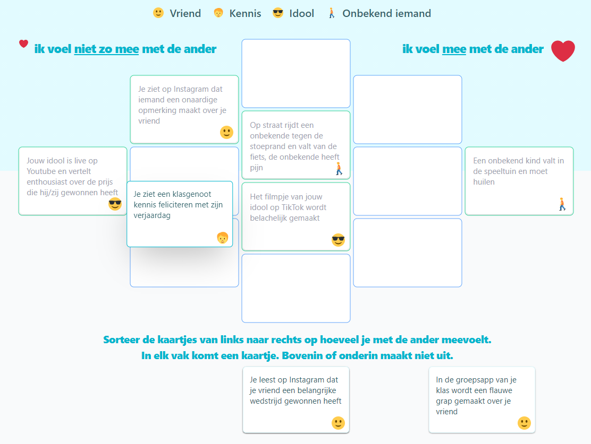

# Sortboard 
 
Sortboard is an application based on the <a href="https://en.wikipedia.org/wiki/Q_methodology">Q Methodology</a>.



This application is created for primary education. There is also an application created for secondary/higher education which can be found <a href="https://github.com/Citolab/qsort">here</a>

<a href="https://www.cito.nl/kennis-en-innovatie/prototypes/projecten/sortboard">Click here</a> for more information (Dutch only).

The live version can be found here: <a href="https://citolab-sortboard.web.app/">https://citolab-sortboard.web.app/</a> and the teacher dashboard: <a href="https://docent-citolab-sortboard.web.app/">https://docent-citolab-sortboard.web.app/</a>


# Techniques

This repository is created with <a href="https://nx.dev/">Nx</a>. It contains two React applications: one for the students and a dashboard application for the teacher. 

Most components used in the application can be viewed en tested apart from the application in <a href="https://storybook.js.org/">Storybook</a>

The dashboard of the teacher uses read models to view the students data. Firebase functions update readmodels when (student) documents are changed. The 'Blaze Pay as you go' firebase plan is needed to be able to deploy this functions. To try this example you probably won't be charged because of the free initial credits you'll have and by default is asks to set a budget (prefilled with 25$). But a credit card should be coupled.

### static data

The cards to be sort are hard-coded here: ```libs\data\src\lib\static.ts``


